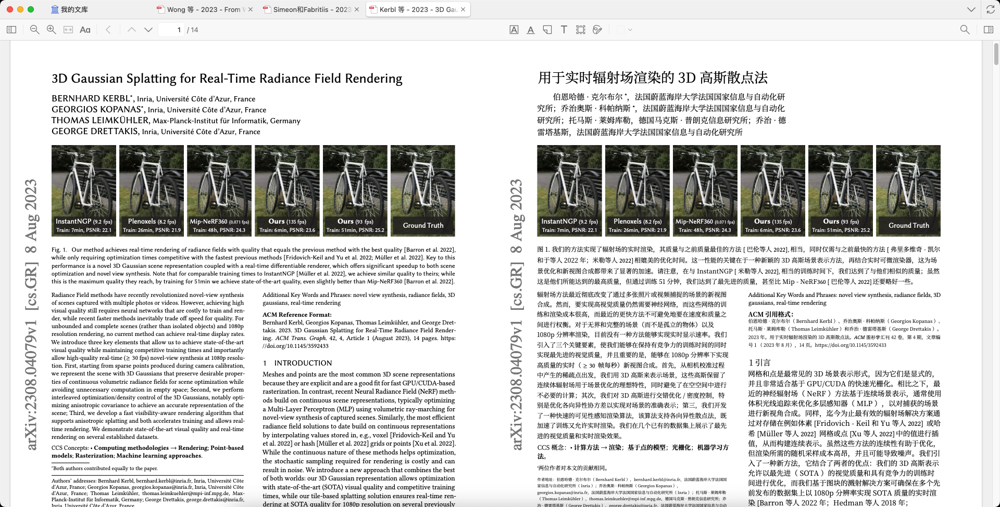
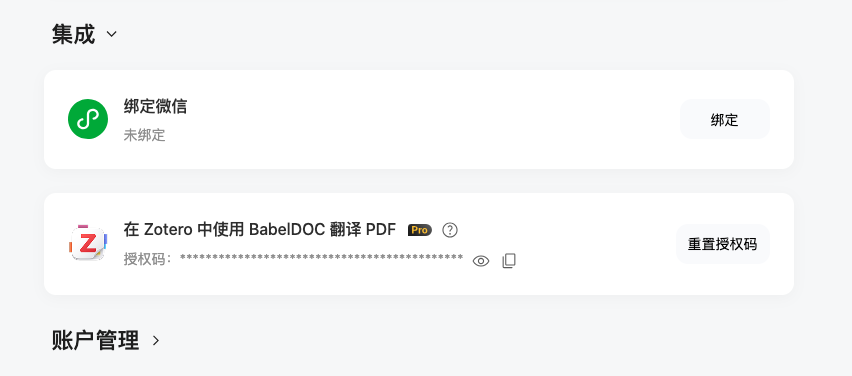
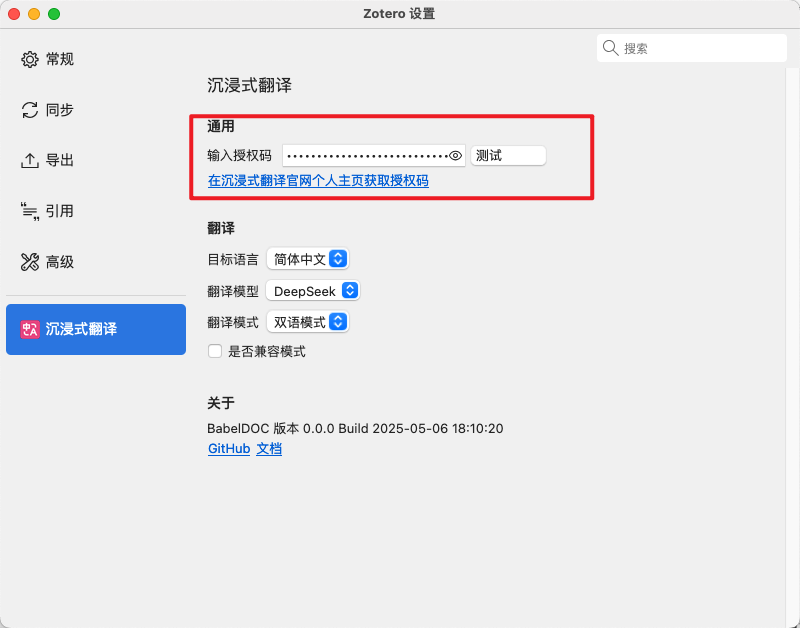
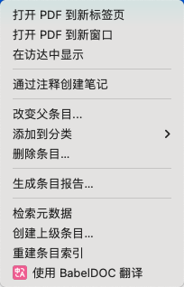
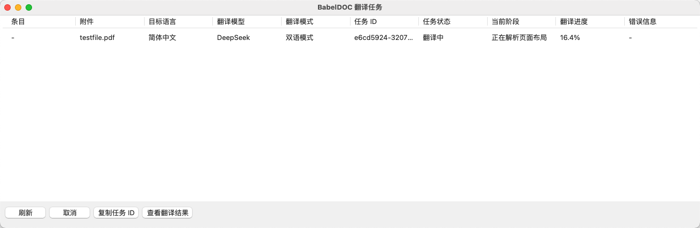

# Zotero Immersive Translate plugin

这是沉浸式翻译的 Zotero 插件，使用 [BabelDOC](https://github.com/funstory-ai/BabelDOC) 翻译 Zotero 的 PDF 文献。

> [!NOTE]
> 本插件基于 Zotero 7 开发，不兼容 Zotero 6，请升级至最新版本。

[在网页中使用 BabelDOC](https://app.immersivetranslate.com/babel-doc/)

## 预览

## 下载

[在 Releases 页面下载](https://github.com/immersive-translate/zotero-immersivetranslate/releases)

## 使用

1. 安装插件，在[ Releases ](https://github.com/immersive-translate/zotero-immersivetranslate/releases)页面下载最新的`.xpi`文件，在 Zotero 的插件管理页面安装并启用

2. 在 [沉浸式翻译](https://immersivetranslate.com/profile) 官网个人主页获取 Zotero 授权码

3. 在插件的设置页面，粘贴你的 Zotero 授权码，点击 `测试` 按钮，如果显示 `测试成功`，则说明配置成功

4. 在设置页面配置目标语言、翻译模型、翻译模式等等。

5. 在 Zotero 的文献管理页面，右键文件，出现右键菜单，选择 `使用沉浸式翻译`

6. 在弹出的窗口中二次确认，之后会出现任务管理窗口，显示翻译任务的进度。

## 翻译任务管理

在任务管理窗口，可以查看翻译任务的进度及结果。

选中某一项任务，点击窗口底部的按钮，进行对应操作。

### 取消

目前仅支持取消未开始的任务。

### 复制任务 ID

当翻译任务开始后，会产生一个任务 ID，可以点击 `复制任务 ID` 按钮，复制任务 ID。

当翻译失败，或出现错误，可以复制任务 ID，进行反馈。

### 查看翻译结果

当翻译任务完成后，可以点击 `查看翻译结果` 按钮，直接用阅读器打开翻译后的 PDF。

## 翻译任务的恢复

当翻译开始后，如果关闭 Zotero 客户端，会存储未完成的翻译任务。

再次打开 Zotero 客户端，插件会自动恢复未完成的翻译任务，已完成的任务不会存储。

## 快捷键

- `Shift+A` 翻译选中的文献
- `Shift+T` 打开任务管理窗口

## FAQ

### 为什么我配置了 Zotero 授权码，但是还是不能使用？

请检查你的 Zotero 授权码是否正确，是否过期。

目前 Zotero 仅支持沉浸式翻译 Pro 用户使用。

### 如果翻译失败了，怎么办？

可以复制任务 ID，进行反馈。

### 如果翻译结果不满意，怎么办？

可以复制任务 ID，进行反馈。

## 不小心关闭了任务管理窗口，怎么办？

可以在 Zotero 的 `查看` 菜单下，点击 `查看沉浸式翻译任务`，打开任务管理窗口。

## 反馈

如果是插件功能问题，可以在 [Issues](https://github.com/immersive-translate/zotero-immersivetranslate/issues) 中反馈。

如果是翻译结果问题，可以 [加入 BabelDOC 的内测群](https://immersivetranslate.com/zh-Hans/docs/communities/)，发生任务 ID 进行反馈。

## 贡献

请查看 [贡献指南](CONTRIBUTING.md)。
